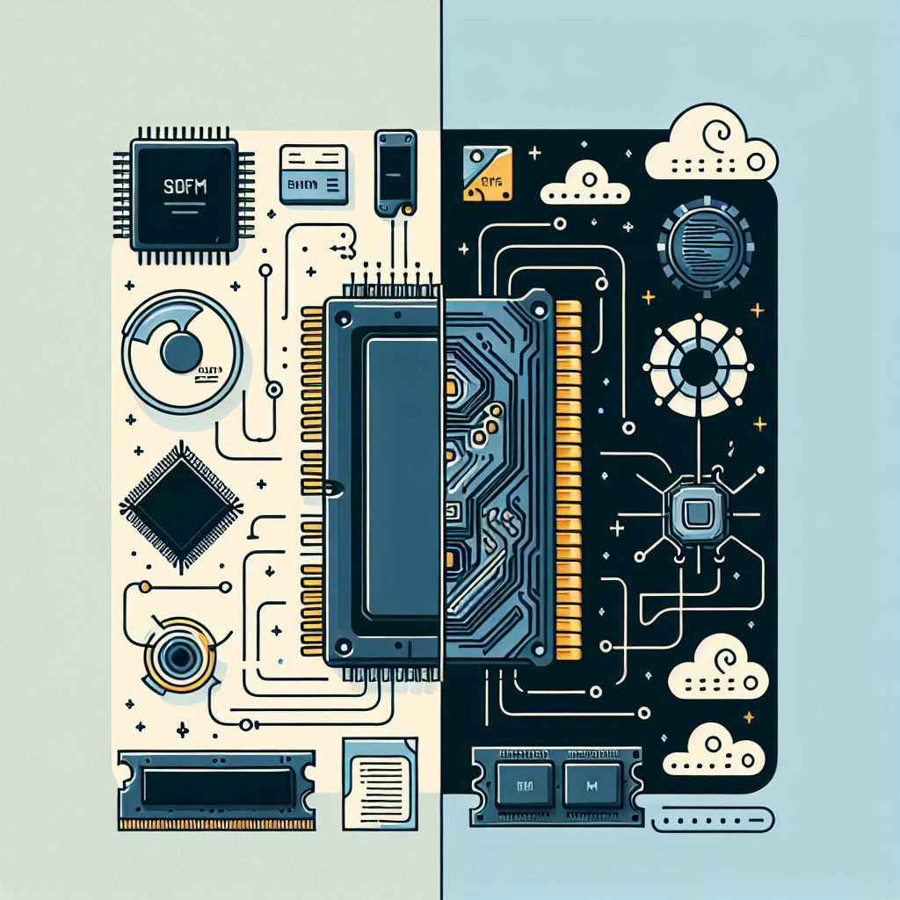

## The beginning...

Like many who have chosen to throw themselves into the world of software engineering, my interest in this field started from playing video games.
During high school, I had come upon a game that promoted game development and all the resources required to create a simple game was provided.
A door to the world of programming was opened, and I was eager to take my first step in.
Thus, my journey to learning my very first programming language, Lua, began... Then died the week after.

## The reality...

**Too much** work for _so_ little gameplay.
**Too much** designing!
What do you mean I can't just copy scripts from YouTube videos made by kids several years younger than me?
My interest was dead as a rock, and just like how you would treat any other rock, I skipped it across the Lake of Notachance, and left it to sink and never be seen again.
However, it was seen again; in my first year of robotics and last year of high school.
The lead programmer had quit a few months after summer, and the role had been thrown directly onto my lap.

It was a struggle, but I _loved_ it. I had only two months worth of Java experience, but as luck would have it, it wasn't the standard Java; it was Java specialized for the robotics competition. I didn't understand the low-level technicalities, but I understood enough to get the desired results and it was fun. All the problem solving, forum divings, hardware and the aspects that comes with integrating software with hardware was fulfilling.

## The two sides of the same chip: software and hardware

It was then that I realized that my interest wasn't in software engineering alone but when it's integrated into hardware. Thus, another door was opened and I have since began walking the road to embedded systems. As a computer engineering student in University of Hawaii at Manoa, I have the best of both worlds as I'm taking multiple courses for electrical engineering and some for computer science. I have come across a fork in the road, in which one leads to embedded systems and the other leads to VLSI design. In the meantime, I wish to gain more experience in digital circuits design and HDLs, and learn assembly.
