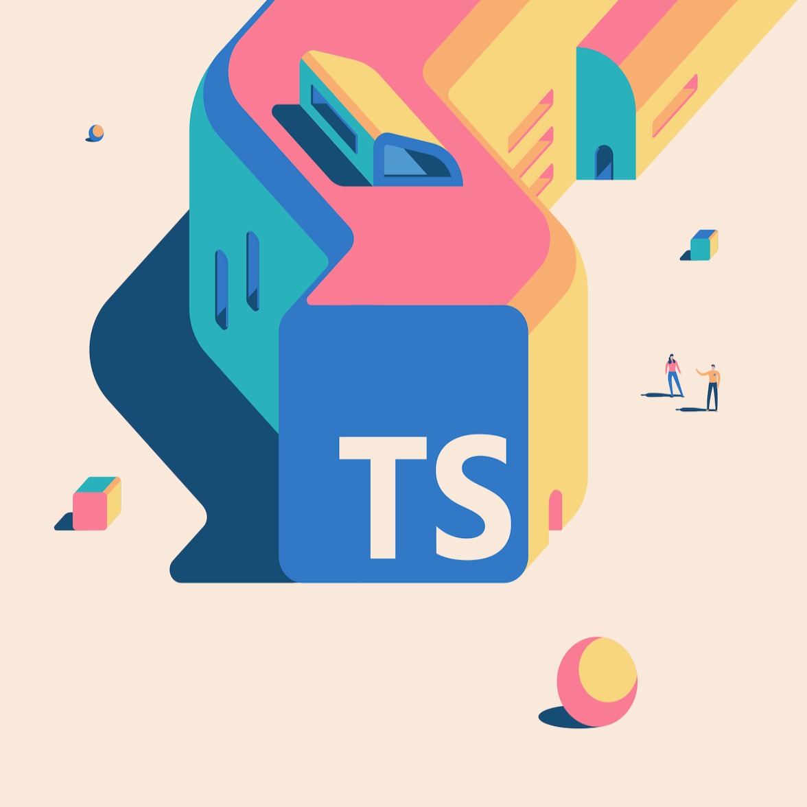

## "TypeScript is a superset of JavaScript"

"Which came first: the chicken or the egg?"

Luckily, this question isn't as deep when applied to JavaScript and TypeScript, as without the former, the latter would not exist. This makes sense as the former builds upon the latter with additional features. Hence is why, learning JavaScript first is a must before moving on to its more-refined sibling.

## What JavaScript lacks...

However, though TypeScript is considered to be more complex than JavaScript, those who have previously been only exposed to statically-typed languages may be disordered by not being able to explicitly specify the type of their variables. I certainly was. Declarations had always felt like I had skipped a step and that an onslaught of errors would be waiting at my doorstep to present themselves when the program is run. On a positive note, it was nice to be able to create small programs without the need to worry about such specifics.

## TypeScript overcomes

Nevertheless, a computer cannot always accurately infer what a human wants it to do. As a program becomes larger, its complexity follows, and the margin for error increases. This is where TypeScript is the best companion for the job. It requires more effort, but the time spared from having to deal with errors due to its reliability is well worth it.
