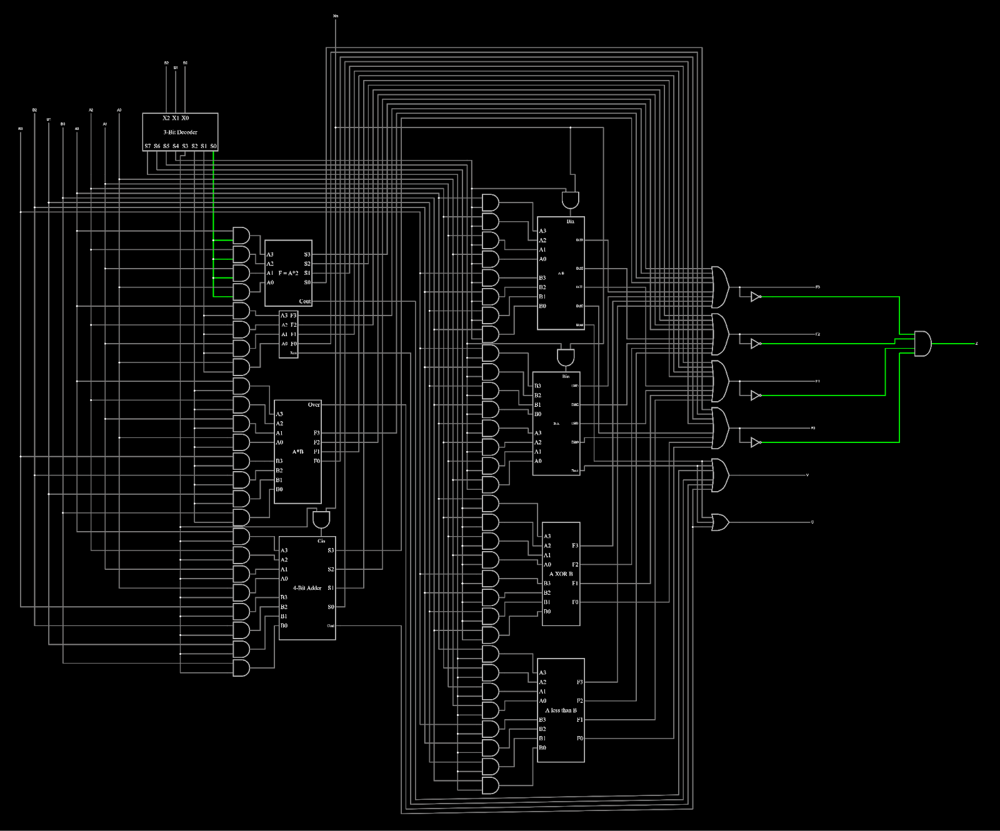
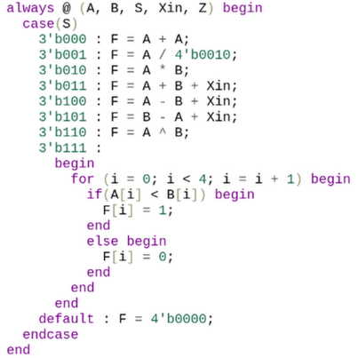

  
  

## What is an ALU?

An ALU, which stands for Arithmetic Logic Unit, is an important component of a computer's CPU as it performs arithmetic and logic operations on binary data. Therefore, it can also be thought of as the "brain" as it carries out essential tasks required for processing instructions. An ALU can do many different calculations depending on its design, be it arithmetic, logic, bitwise, or comparison operations.

For this specific 4-bit ALU, it was designed to be able to perform these eight basic functions on two 4-bit binary data:

1. Addition with carry in and carry out
2. Subtraction with borrow in and borrow out
3. Subtraction (switched inputs) with borrow in and borrow out
4. Doubling input A with an overflow flag
5. Halving input A with an overflow flag
6. Multiplication with an overflow flag
7. XOR
8. A less than B

## Logic Gate Design

To put our skills to the test, students were tasked to design an ALU in the logic gate-level, and program in SystemVerilog using EDA Playground. As a solo project, I divided the work by operations and worked up from simple calculations such as addition before getting to more complex ones such as multiplication. As I wired each operations together, I realized how some operations were closely related to each other and how I could recycle some subcircuits for other operations.

Looking back now, there were definitely ways in which some operations could have been better simplified such as through the use of flip-flops.

## SystemVerilog

To design this 4-bit ALU in SystemVerilog, a behavioral method was used to create a simple program. Below is the block of code that defined the ALU's operations.

Going through both gate-level and HDL designs really gives you perspective on how desirable the latter can be for abstract-level design and how educational the former is for learning digital circuit design.

## GitHub

To further explore the details of this project, you can check out its [GitHub page](https://github.com/domalian/ALU).
