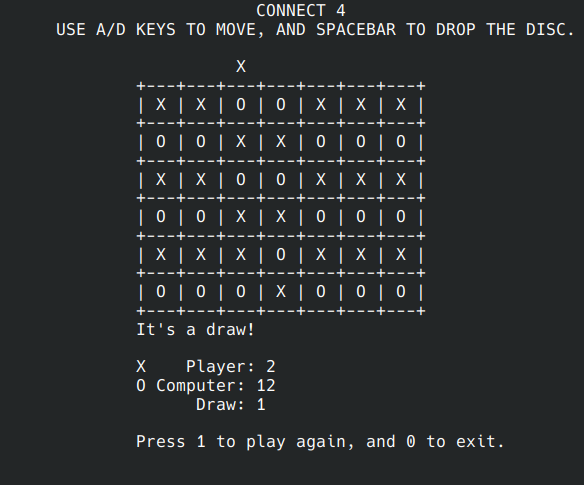

  

## About

_Connect Four_ is an online game that functions similarly to the identically-named game, Connect 4, programmed in C as the final group project for EE 160. The player was set to be able to play with another player or a computer that randomly places its pieces, named as 'discs,' across a 6 x 7 grid. Just like the renowned Connect 4 game, the player must place their discs four in a row either horizontally, vertically, or diagonally. When neither user wins after the final square is filled, it will be considered a draw. The game can keep track of how many games are won by either player or ended in a draw. For additional texture, the player(s) can choose their own piece, be it 'X' or 'C'.

## Background

As the lead for this group project, I programmed the basic algorithms required to map the grid, win or draw, keep track of the score and placement of the discs, and generate the Computer's moves. This was the first project that involved building a program up from scratch, and I was happy to be able to put topics like multi-dimensional arrays, pointers, loops, and algorithms into practice. Unlike most my prrevious projects before _Connect Four_, this required detailed planning, research, and communication between group members to bring it to its completion.

## How to run

To keep the text-based user interface of the grid, the curses package was used. To run 'Connect4', clone the repo, recompile the files using `gcc -o connect4 functions.c connect4.c -lncurses`, and then run the command `./connect4`.

To further explore the details of this project, you can check out its [GitHub page](https://github.com/domalian/connect-four).
