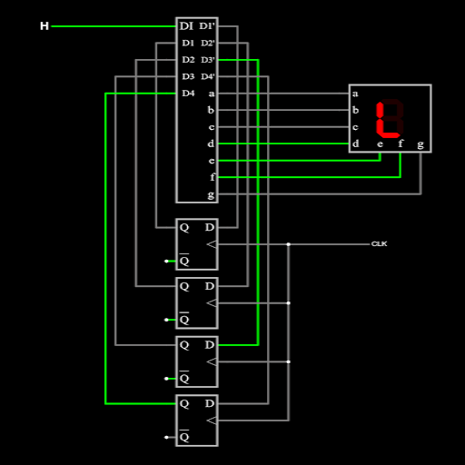
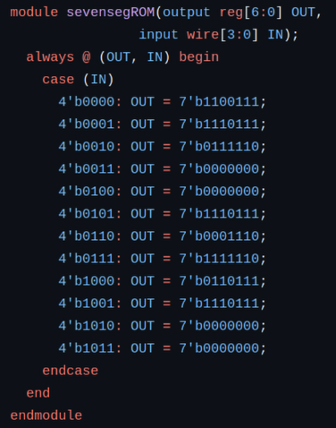

  

## What is a finite state machine?

A sequential logic circuit is designed in which its input and output are defined by their current state depending on rules that were implemented. A Finite State Machine (FSM) is a computational model frequently used in designing such sequential logic circuits with a finite number of distinct states. To be more specific for this project, it manages how states transition based on inputs and the current state to control the behavior of the system.

## Creation Process

To start the design process, I made a state diagram to have a better visualization of how the 7-segment display would transition from one letter to another depending on an input and its current state. Once I had a good foundation of how the circuit would behave, to further expand on the transitioning of each segments of the display, a truth table was made. To keep it simple, I used the truth table to create a custom digital circuit instead of building it with logic gates.

Afterwards, I designed a 4-bit counter using four D flip flops to manage the timing of the transitions.

## End Result

  

By end of this project, I became much more comfortable with working with FSM designs. Before this, I had only been working with combinational logic, so this project made the process to making sequential logic circuits more familiar to me. I learned how to put the truth table into practice, and realized the importance of drawing a proper state diagram as it proved to be the best reference when creating the truth table and for debugging.

## SystemVerilog

For more practice with SystemVerilog, I made a small program of this model using behavioral methods.

Below is the block of code that defined the states. Here, only 4 bits were used since the current state really only used 3 bits. The fourth and highest bit was then used for inputs.

  

## GitHub

To further explore the details of this project, you can check out its [GitHub page](https://github.com/domalian/scrolling-sign).
